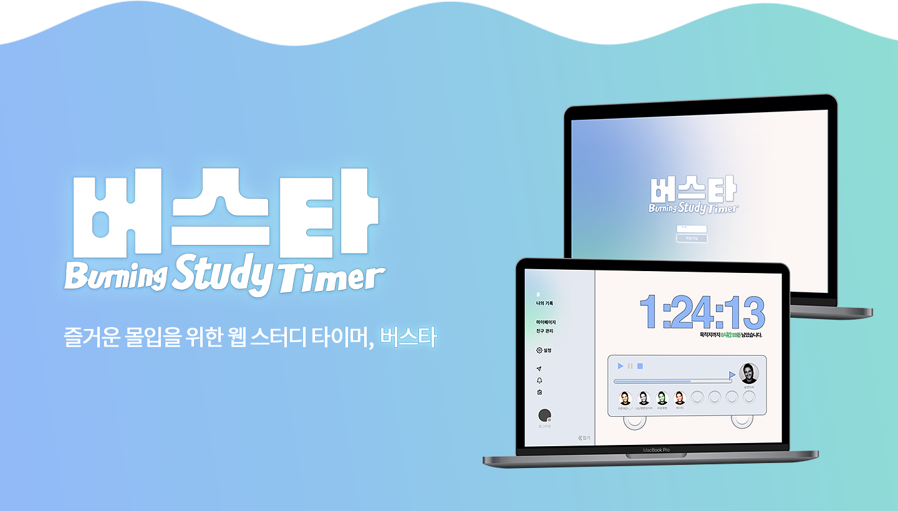

# 🚌 버스타 - Burning Study Timer
### 즐거운 몰입을 위한 웹 스터디 타이머, 버스타! ⏱️ 
### v1.0.0

<!--🔗 https://busta.store-->
  

## 🧑‍🤝‍🧑 TEAM <햄듭니다>
||||||
|:---:|:---:|:---:|:---:|:---:|
|강예현|시승연|류예진|박채연|허다빈|
|프론트엔드|프론트엔드|프론트엔드|백엔드|백엔드|

 

## 어떻게 사용하나요?
### 🚌 버스 모양 타이머 
목표를 향해 달리는 나만의 학습 버스! 탑승이 준비되셨나요?

### 👯 스터디 메이트
공부는 함께 할수록 즐겁죠. 현재 접속중인 친구와 함께 서로를 응원해요!

### 📋 목표 설정과 나의 기록
나의 학습 목표를 설정하고, 성장을 기록하세요.

### 🧘 마이페이지
버스에 탑승하기 전, 나의 개성 있는 프로필을 완성해 보세요.

### 💬 친구 관리와 다이렉트 메시지
친구들과 편리하게 소통하며 성장하는 학습 커뮤니티!

### 🔔 알림과 공지 모아보기
모든 중요한 소식을 놓치지 않고 확인할 수 있어요.

 

## 🎥 시연영상 바로가기

 

## ⚙️ 프로젝트에 사용했어요

 

## 릴리즈 노트
### v1.0.0 
24 . 8 . 27 .  BUSTA 서비스 시작
